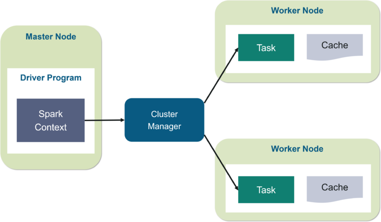

[](https://travis-ci.com/mtumilowicz/big-data-scala-spark-batch-workshop)
[](https://www.gnu.org/licenses/gpl-3.0)

# big-data-scala-spark-batch-workshop
* references
    * [Learning Spark, 2nd Edition](https://www.oreilly.com/library/view/learning-spark-2nd/9781492050032/)
    * [Spark in Action, Second Edition](https://www.manning.com/books/spark-in-action-second-edition)
    * https://medium.com/@mrpowers/testing-spark-applications-8c590d3215fa
    * https://stackoverflow.com/questions/43729262/how-to-write-unit-tests-in-spark-2-0/50581218#50581218
    * https://sparkbyexamples.com/spark/spark-read-and-write-json-file/
    * https://sparkbyexamples.com/spark/spark-schema-explained-with-examples/
    * https://sparkbyexamples.com/spark/spark-read-and-write-json-file/
    * https://bigdataprogrammers.com/merging-two-dataframes-in-spark/
    * https://mungingdata.com/apache-spark/aggregations/
    * https://spark.apache.org/docs/3.0.0-preview/sql-getting-started.html#running-sql-queries-programmatically
    * https://stackoverflow.com/a/43812193 (for windows)
    * https://sparkbyexamples.com/spark/spark-sql-dataframe-join/
    * https://towardsdatascience.com/write-clean-and-solid-scala-spark-jobs-28ac4395424a
    * https://www.edureka.co/blog/spark-architecture/
    * https://spark.apache.org/docs/latest/cluster-overview.html
    * https://queirozf.com/entries/apache-spark-architecture-overview-clusters-jobs-stages-tasks
    * https://data-flair.training/blogs/apache-spark-rdd-vs-dataframe-vs-dataset/
    * https://medium.com/@venkat34.k/the-three-apache-spark-apis-rdds-vs-dataframes-and-datasets-4caf10e152d8
    * https://towardsdatascience.com/strategies-of-spark-join-c0e7b4572bcf
    * https://medium.com/datakaresolutions/optimize-spark-sql-joins-c81b4e3ed7da
    * https://databricks.com/glossary/tungsten
    * https://jaceklaskowski.gitbooks.io/mastering-spark-sql/content/spark-sql-tungsten.html
    * https://www.dezyre.com/article/how-data-partitioning-in-spark-helps-achieve-more-parallelism/297
    * https://luminousmen.com/post/spark-partitions
    * https://www.24tutorials.com/spark/flatten-json-spark-dataframe/
    * https://medium.com/@dvcanton/wide-and-narrow-dependencies-in-apache-spark-21acf2faf031
    * https://towardsdatascience.com/best-practices-for-caching-in-spark-sql-b22fb0f02d34
    * https://medium.com/@adrianchang/apache-spark-checkpointing-ebd2ec065371
    * http://www.lifeisafile.com/Apache-Spark-Caching-Vs-Checkpointing/
    * https://stackoverflow.com/questions/24696777/what-is-the-relationship-between-workers-worker-instances-and-executors
    * https://www.tutorialkart.com/apache-spark/cluster-managers-supported-in-apache-spark/
    * https://www.informit.com/articles/article.aspx?p=2928186

## preface
* goals of this workshop:
    * introduction to spark and its architecture of spark
    * peek under the hood: data representation and optimizations
    * practicing rudimentary use-cases

## spark
* unified engine designed for large-scale distributed data processing
* provides in-memory storage for intermediate computations
    * faster than Hadoop MapReduce
* libraries
    * machine learning (MLlib)
    * SQL for interactive queries (Spark SQL)
    * stream processing (Structured Streaming) based on micro-batch processing engine
    * graph processing (GraphX)
* typical Spark scenario
    1 Ingestion of raw data
    1 DQ: data quality
        * example: ensure that all birth dates are in the past
        * example: obfuscate Social Security numbers (SSNs)
    1 Transformation
        * example: join with other datasets, perform aggregations
    1 Publication
        * example: load the data into a data warehouse, save in a file on S3
# components overview
* components and architecture
    
    * SparkSession
        * a single unified entry point to all of Spark’s functionality
        * use cases
            * defining DataFrames and Datasets
            * reading from data sources
            * writing to data lakes
            * accessing catalog metadata
            * issuing Spark SQL queries
        * there is a unique SparkSession for your application, not matter how many nodes it runs
    * Spark driver
        * process running the `main()` function of the application
        * instantiates SparkSession
        * communicates with the cluster manager
        * requests resources (CPU, memory, etc.) from the cluster manager for Spark’s executors (JVMs)
        * plans and coordinates the execution: transforms operations into directed acyclic graph (DAG)
        and schedules them
            * keeps track of available resources to execute tasks
            * schedules tasks to run "close" to the data where possible (data locality)
        * distributes operations execution across the Spark executors
        * once the resources are allocated, it communicates directly with the executors
        * resides on master node
    * Spark master & Cluster manager
        * Cluster Manager can be separate from the Master process
        * Spark master requests resources and makes resources available to the Driver
            * monitors the status and health of resources
            * is not involved in the execution of the application and the coordination of its tasks and stages
        * Cluster manager is a process responsible for monitoring the Worker nodes and reserving resources
        on these nodes upon request by the Master
            * Master then makes these cluster resources available to the Driver in the form of Executors
    * Worker node
        * any node that can run application code in the cluster
        * may not share filesystems with one another
    * Spark executor
        * is a process that executes tasks on the workers often in parallel
        * communicates with the driver program
        * workers hold many executors, for many application
    * Job
        * is a sequence of Stages, triggered by an action (ex. `.count()`)
    * Stage
        * a sequence of Tasks that can all be run in parallel without a shuffle
        * example: `.read.map.filter`
    * Task
        * unit of work that will be sent to one executor
        * is a single operation (ex. `.map` or `.filter`) applied to a single Partition
        * is executed as a single thread in an Executor
        * example: 2 Partitions, operation: `filter()` => 2 Tasks, one for each Partition
    * Shuffle
        * operation where data is re-partitioned across a cluster
            * by having all the data needed to calculate on a single node, we reduce the
            overhead on the shuffle (the need for serialization and network traffic)
        * costly operation - a lot of data travels via the network
        * example: join and any operation that ends with ByKey will trigger a Shuffle
    * Partition
        * enable parallelization: data is split into Partitions so that each Executor can operate
        on a single part
            * once the user has submitted his job into the cluster, each partition is sent to a
            specific executor for further processing
            * the more partitions the more work is distributed to executors, with a smaller number
            of partitions the work will be done in larger pieces
        * every machine in a spark cluster contains one or more partitions
            * single partition do not span multiple machines
        * good starting point: number of partitions equal to the number of cores
            * example
                * 4 cores and 5 partitions
                * processing of each partition takes 5 minutes
                * total time: 10 minutes (4 in parallel in 5 minutes, then 1 in 5 minutes)
    * deployment on Kubernetes
        * Spark driver: Runs in a Kubernetes pod
        * Spark executor: Each worker runs within its own pod
        * Cluster manager: Kubernetes Master

## data representation
* RDD (Resilient Distributed Datasets)
    * fundamental data structure of Spark
    * immutable distributed collection of data
        * data itself is in partitions
* Dataset and DataFrame
    * take on two characteristics: DataFrame - typed and Dataset - untyped APIs
    * Dataset is a collection of strongly typed JVM objects
        * has also an untyped view called a DataFrame, which is a Dataset of Row
            * Row is a generic untyped JVM object that may hold different types of fields
                * get first column of given row: `val name = row.getString(0)`
    * DataFrames are similar to distributed in-memory tables with named columns with types
    (integer, string, array, map, etc), schemas
        * no primary or foreign keys or indexes in Spark
        * data can be nested, as in a JSON or XML document
            * it's often useful to flattening JSON to facilitate using sql syntax
                * flattening JSON = converting the structures into fields and exploding the arrays into distinct rows
                
                
                * example: perform aggregates (group by)
    * conversion: DataFrame -> Dataset
        ```
        val bloggersDS = spark
          .read
          .json("path")
          .load()
          .as[TargetClass]
        ```
* schemas
    * defines the column names and associated data types for a DataFrame
    * inferring a schema (plus inferring data types)
        * requires separate job to read a large portion of file to infer the schema
        * can be expensive and time-consuming
        * no errors detection if data doesn’t match the schema
    * defining a schema
        * programmatically: `val schema = StructType(Array(StructField("author", StringType, false)`
        * DDL: `val schema = "author STRING, title STRING, pages INT"`

## data import / export
* typical use case: read from on-premise database and push to cloud storage (Amazon S3)
* data source types
    * file (CSV, JSON, XML, Avro, Parquet, and ORC, etc)
    * relational and nonrelational database
    * other data provider: (REST) service, etc
* DataFrameReader
    * core construct for reading data into a DataFrame
    * supports many formats such as JSON, CSV, Parquet, Text, Avro, ORC, etc.
* DataFrameWriter
    * it saves data to a data source
    * after the files have been successfully exported, Spark will add a _SUCCESS file to the
      directory
    
### file formats
* problem with traditional file formats
    * big data files need to be splittable
        * JSON and XML are not easy to split
    * CSV cannot store hierarchical information (like JSON or XML)
    * none designed to incorporate metadata
    * quite heavy in size (especially JSON and XML)
* big data formats: Avro, ORC, or Parquet
    * Avro 
        * schema-based serialization format (binary data)
        * supports dynamic modification of the schema
        * row-based, so easier to split
    * ORC 
        * columnar storage format
        * supports compression
    * Parquet 
        * columnar storage format
        * supports compression
        * add columns at the end of the schema
        * Parquet metadata usually contains the schema
            * if the DataFrame is written as Parquet, the schema is preserved as part of the Parquet metadata
              * subsequent reads do not require you to supply a schema
        * default and preferred data source for Spark
        * files are stored in a directory structure: data files, metadata, a number of compressed files,
        and some status files
## data transformation
* operations can be classified into two types
    * actions
        * example: `count()`, `save()`
        * triggers evaluation
    * transformations
        * `DataFrame -> DataFrame`
        * example: `select()`, `filter()`
        * evaluated lazily
            * results are recorded as a lineage
                * allows to optimize queries (rearrange certain transformations, coalesce them, etc.)
                * provides fault tolerance: reproduce its state by replaying the lineage
        * two types

            
    
### aggregations
* DataFrame API
    ```
    Dataset<Row> apiDf = df
        .groupBy(col("firstName"), col("lastName"), col("state"))
        .agg(
            sum("quantity"),
            sum("revenue"),
            avg("revenue"));
    ```
    is equivalent to
    ```
    df.createOrReplaceTempView("orders");
  
    String sqlStatement = "SELECT " +
        " firstName, " +
        " lastName, " +
        " state, " +
        " SUM(quantity), " +
        " SUM(revenue), " +
        " AVG(revenue) " +
        " FROM orders " +
        " GROUP BY firstName, lastName, state";
  
    Dataset<Row> sqlDf = spark.sql(sqlStatement);
    ```
### joins
* Broadcast Hash Join (map-side-only join)
    * used when joining small with large
        * small = fitting in the driver’s and executor’s memory
    * smaller data set is broadcasted by the driver to all Spark executors
    * by default if the smaller data set is less than 10 MB
    * does not involve any shuffle of the data set
* Shuffle Sort Merge Join
    * used when joining two large data sets
    * default join algorithm
    * pre-requirement: partitions have to be co-located
        * all rows having the same value for the join key should be stored in the same partition 
        * otherwise, there will be shuffle operations to co-locate the data
    * has two phases
        * sort phase
            * sorts each data set by its desired join key
        * merge phase
            * iterates over each key in the row from each data set and merges 
              the rows if the two keys match
### sql
* tables
    ```
    ids.write
        .option("path", "/tmp/five_ids")
        .saveAsTable("five_ids")
    ```
    * each table is associated with its relevant metadata (the schema, partitions, physical location
      where the actual data resides, etc.)
        * metadata is stored in a central metastore
            * by default: Apache Hive metastore
                * Catalog is the interface for managing a metastore
                    * spark.catalog.listDatabases()
                    * spark.catalog.listTables()
                    * spark.catalog.listColumns("us_delay_flights_tbl")
                * location: /user/hive/warehouse
    * two types of tables
        * managed
            * Spark manages metadata and the data
            * example: local filesystem, HDFS, Amazon S3
            * note that SQL command such as DROP TABLE deletes both the metadata and the data
                * with an unmanaged table, the same command will delete only the metadata
        * unmanaged
            * Spark only manages the metadata
            * example: Cassandra
* views
    * vs table: views don’t actually hold the data
        * tables persist after application terminates, but views disappear
    * to enable a table-like SQL usage in Spark - create a view
        ```      
        df.createOrReplaceTempView("geodata");
      
        Dataset<Row> smallCountries = spark.sql("SELECT * FROM ...");
        ```
    
## optimizations
* at the core of the Spark SQL engine are the Catalyst optimizer and Project Tungsten
* note that a lot of the issues can come from key skewing: the data is so fragmented among
  partitions that a join operation becomes very long

### tungsten
* focuses on enhancing three key areas
    * memory management and binary processing
        * manage memory explicitly
            * off-heap binary memory management
        * eliminate the overhead of JVM object model and garbage collection
            * Java objects have large overheads — header info, hashcode, Unicode info, etc.
            * instead use binary in-memory data representation aka Tungsten row format
    * cache-aware computation
        * algorithms and data structures to exploit memory hierarchy (L1, L2, L3)
        * cache-aware computations with cache-aware layout for high cache hit rates
    * code generation
        * exploit modern compilers and CPUs
        * generates JVM bytecode to access Tungsten-managed memory structures that gives a very fast access
        * uses the Janino compiler - super-small, super-fast Java compiler

### catalyst
* similar concept to RDBMS query optimizer
* converts computational query and converts it into an execution plan
    
* Phase 1: Analysis
    * Spark SQL engine generates AST tree for the SQL or DataFrame query
* Phase 2: Logical optimization
    * catalyst constructs a set of multiple plans and using its cost-based
      optimizer assign costs to each plan
* Phase 3: Physical planning
    * Spark SQL generates an optimal physical plan for the selected logical plan
* Phase 4: Code generation
    * generating efficient Java bytecode to run on each machine

### caching
* Spark maintains a history of all transformations you may apply to a DataFrame or RDD
    * this enables Spark to be fault tolerant
    * however Spark programs take a huge performance hit when fault occurs
    as the entire set of transformations to RDD have to be recomputed
* if you reuse a dataframe for different analyses, it is a good idea to cache it
    * steps are executed each time you run an analytics pipeline
    * example: DataFrames commonly used during iterative machine learning training
* caching vs persistence
    * persist() provides more control over how and where data is stored
        * DISK_ONLY, OFF_HEAP, etc.
    * both are lazy transformations
        * immediately after calling the function nothing happens with the data
        but the query plan is updated by the Cache Manager by adding a
        new operator — InMemoryRelation
* caching vs checkpointing
    * whatever is the case of failure, re-calculating the lost partitions is the most expensive operation
        * best strategy is to start from some checkpoint in case of failure
    * checkpoint() method will truncate the logical plan (DAG) and save the content of the dataframe to disk
        * re-computations need not be done all the way from beginning, instead the checkpoint is used
        as the beginning of re-calculation
    * cache will be cleaned when the session ends
        * checkpoints will stay on disk
    * example where checkpointing would be preferred over caching
        * DataFrame of taxes for a previous year - they are unlikely to change once calculated so
        it would be much better to checkpoint and save them forever so that they can be consistently
        reused in the future

### user-defined functions
```
val cubed = (s: Long) => { s * s * s } // define function

spark.udf.register("cubed", cubed) // register UDF

spark.sql("SELECT id, cubed(id) AS id_cubed FROM ...") // use
```
* excellent choice for performing data quality rules
* UDF’s internals are not visible to Catalyst
    * UDF is treated as a black box for the optimizer
    * Spark won’t be able to analyze the context where the UDF is called
        * if you make dataframe API calls before or after, Catalyst can’t optimize
          the full transformation
        * should be at the beginning or the end of transformations