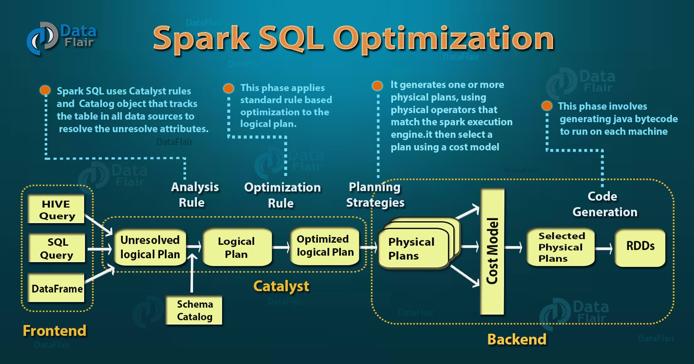

# big-data-scala-spark-batch-workshop
* references
    * [Learning Spark, 2nd Edition](https://www.oreilly.com/library/view/learning-spark-2nd/9781492050032/)
    * [Spark in Action, Second Edition](https://www.manning.com/books/spark-in-action-second-edition)
    * https://medium.com/@mrpowers/testing-spark-applications-8c590d3215fa
    * https://stackoverflow.com/questions/43729262/how-to-write-unit-tests-in-spark-2-0/50581218#50581218
    * https://sparkbyexamples.com/spark/spark-read-and-write-json-file/
    * https://sparkbyexamples.com/spark/spark-schema-explained-with-examples/
    * https://sparkbyexamples.com/spark/spark-read-and-write-json-file/
    * https://bigdataprogrammers.com/merging-two-dataframes-in-spark/
    * https://mungingdata.com/apache-spark/aggregations/
    * https://spark.apache.org/docs/3.0.0-preview/sql-getting-started.html#running-sql-queries-programmatically
    * https://stackoverflow.com/a/43812193 (for windows)
    * https://sparkbyexamples.com/spark/spark-sql-dataframe-join/
    * https://towardsdatascience.com/write-clean-and-solid-scala-spark-jobs-28ac4395424a
    * https://www.edureka.co/blog/spark-architecture/
    * https://spark.apache.org/docs/latest/cluster-overview.html
    * https://queirozf.com/entries/apache-spark-architecture-overview-clusters-jobs-stages-tasks
    * https://data-flair.training/blogs/apache-spark-rdd-vs-dataframe-vs-dataset/
    * https://medium.com/@venkat34.k/the-three-apache-spark-apis-rdds-vs-dataframes-and-datasets-4caf10e152d8

## preface

## spark
* a unified engine designed for large-scale distributed data processing, on premises in data centers 
  or in the cloud
* provides in-memory storage for intermediate computations
    * faster than Hadoop MapReduce
* incorporates libraries for
    * machine learning (MLlib)
    * SQL for interactive queries (Spark SQL)
    * stream processing (Structured Streaming) for interacting with real-time data
    * graph processing (GraphX)
* four steps of a typical Spark scenario
    1 Ingestion
        * at this stage, the data is raw
    1 Improvement of data quality (DQ)
        * example: ensure that all birth dates are in the past
        * example: obfuscate Social Security numbers (SSNs)
    1 Transformation
        * example: join with other datasets, perform aggregations
    1 Publication
        * people in your organization can perform actions on it and make decisions based on it
        * example: load the data into a data warehouse, save in a file on S3
# components overview
* components and architecture
    
    * SparkSession
        * provides a single unified entry point to all of Spark’s functionality
            * defining DataFrames and Datasets
            * reading from data sources
            * writing to data lakes
            * accessing catalog metadata
            * issuing Spark SQL queries
        * there is a unique SparkSession for your application, whether you are in local mode or have 10,000 nodes
    * Spark driver
        * process running the `main()` function of the application
        * instantiates SparkSession
        * communicates with the cluster manager
        * requests resources (CPU, memory, etc.) from the cluster manager for Spark’s executors (JVMs)
        * transforms operations into DAG computations and schedules them
            * directed acyclic graph (DAG) is a finite directed graph with no directed cycles
        * distributes operations execution as tasks across the Spark executors
            * does not run computations (filter,map, reduce, etc)
        * once the resources are allocated, it communicates directly with the executors
        * resides on master node
    * Cluster manager
        * manages and allocates resources for the cluster of nodes on which your Spark application runs
        * supports four cluster managers
            * the built-in standalone cluster manager
            * Apache Hadoop YARN
            * Apache Mesos
            * Kubernetes
    * Worker node
        * any node that can run application code in the cluster
    * Spark executor
        * runs on each worker node in the cluster
            * only a single executor runs per node
        * communicates with the driver program
        * executes tasks on the workers
    * Job
        * parallel computation consisting of multiple tasks that gets spawned in response
          to a Spark action (e.g. save, collect)
        * is a sequence of Stages, triggered by an action (ex. `.count()`)
    * Stage
        * a sequence of Tasks that can all be run together, in parallel, without a shuffle
        * example: using `.read.map.filter` can all be done without a shuffle, so it can fit in a single stage
    * Task
        * unit of work that will be sent to one executor
        * is a single operation (ex. `.map` or `.filter`) applied to a single Partition
        * each Task is executed as a single thread in an Executor
        * example: if your dataset has 2 Partitions, an operation such as a `filter()` will trigger 2 Tasks,
          one for each Partition
    * Shuffle
        * operation where data is re-partitioned across a Cluster
        * costly operation because a lot of data can be sent via the network
        * example: join and any operation that ends with ByKey will trigger a Shuffle
    * Partition
        * data is split into Partitions so that each Executor can operate on a single part, enabling parallelization
        * example: ingesting the CSV file in a distributed way
            * file must be on a shared drive, distributed filesystem (like HDFS), or shared
              filesystem mechanism such as Dropbox
            * workers will create tasks to read the file
                * worker will assign a memory partition to the task
                * task will read a part of the CSV file and stores them in a dedicated partition
        * why should you care?
            * joining data from the first partition of worker 1 with data in the second partition of worker 2
                * all that data will have to be transferred, which is a costly operation
            * solution: repartition the data
## data representation
* Spark’s Internal Format Versus Java Object Format
    * Java objects have large overheads—header info, hashcode, Unicode info, etc.
    * Instead of creating JVM-based objects for Datasets or DataFrames, Spark allocates
      off-heap Java memory to lay out their data and employs encoders to convert the data
      from in-memory representation to JVM object
* RDD (Resilient Distributed Datasets)
    * fundamental data structure of Spark
    * immutable distributed collection of data
        * data itself is in partitions
* Dataset
    * take on two characteristics: typed and untyped APIs
    * think of a DataFrame in Scala as an alias for a collection of generic objects, `Dataset[Row]`
        * Row is a generic untyped JVM object that may hold different types of fields
            * uses efficient storage called Tungsten
        * DataFrames are like distributed in-memory tables with named columns and
          schemas, where each column has a specific data type: integer, string, array, map, etc
            * there are no primary or foreign keys or indexes in Spark
            * data can be nested, as in a JSON or XML document
        * get first column of given row: `val name = row.getString(0)`
    * Dataset is a collection of strongly typed JVM objects
        * has also an untyped view called a DataFrame, which is a Dataset of Row
    * Converting DataFrames to Datasets
        ```
        val bloggersDS = spark
          .read
          .json("path")
          .load()
          .as[TargetClass]
        ```
* schemas
    * defines the column names and associated data types for a DataFrame
    * defining vs inferring a schema
        * no inferring data types
        * no separate job just to read a large portion of file to ascertain the schema
            * for a large data file can be expensive and time-consuming
        * errors detection if data doesn’t match the schema
    * ways to define a schema
        * programmatically: `val schema = StructType(Array(StructField("author", StringType, false)`
        * DDL: `val schema = "author STRING, title STRING, pages INT"`

## data import / export
* A data source could be any of the following:
    * A file (CSV, JSON, XML, Avro, Parquet, and ORC, etc)
    * A relational and nonrelational database
    * other data provider: (REST) service, etc
* DataFrameReader
    * core construct for reading data into a DataFrame from myriad
      data sources in formats such as JSON, CSV, Parquet, Text, Avro, ORC, etc.
    * can only be accessed through a SparkSession instance
* DataFrameWriter
    * it saves or writes data to a specified built-in data source
    
### file formats
* problem with traditional file formats
    * JSON and XML are not easy to split and big data files need to be splittable
    * CSV cannot store hierarchical information as JSON or XML can
    * none are designed to incorporate metadata.
    * formats are quite verbose (especially JSON and XML), which inflates the file size drastically
* big data brings its own set of file formats: Avro, ORC, or Parquet   
    * Avro 
        * schema-based serialization format (binary data)
        * supports dynamic modification of the schema
        * is row-based, so easier to split
    * ORC 
        * columnar storage format
        * supports compression
    * Parquet 
        * columnar storage format
        * supports compression
        * add columns at the end of the schema
        * Parquet metadata usually contains the schema
            * if the DataFrame is written as Parquet, the schema is preserved as part of the Parquet metadata
              * subsequent reads do not require you supply a schema
        * default and preferred data source for Spark
        * files are stored in a directory structure that contains the data files, metadata,
          a number of compressed files, and some status files
## sql
* SQL Tables and Views
    * each table is Associated with its relevant metadata (the schema, partitions, physical location 
      where the actual data resides, etc.
        * All of this is stored in a central metastore.
    * Instead of having a separate metastore for Spark tables, Spark by default uses the
      Apache Hive metastore, located at /user/hive/warehouse, to persist all the metadata
      about your tables.
* Managed Versus UnmanagedTables
    * Spark allows you to create two types of tables: managed and unmanaged
    * For a man‐
      aged table, Spark manages both the metadata and the data in the file store. This could
      be a local filesystem, HDFS, or an object store such as Amazon S3 or Azure Blob.
    * an unmanaged table, Spark only manages the metadata, while you manage the data
      yourself in an external data source such as Cassandra.
    * With a managed table, because Spark manages everything, a SQL command such as
      DROP TABLE table_name deletes both the metadata and the data.
        * With an unmanaged
          table, the same command will delete only the metadata, not the actual data.
  * Tables reside within a database. By default, Spark creates tables under the default
    database.
    * Spark can create views on top of existing tables
      * The difference between a view and a
        table is that views don’t actually hold the data; tables persist after your Spark applica‐
        tion terminates, but views disappear.   
* Viewing the Metadata
    * as mentioned previously, Spark manages the metadata associated with each managed
      or unmanaged table.
        * This is captured in the Catalog , a high-level abstraction in
          Spark SQL for storing metadata.
    * spark.catalog.listDatabases()
      spark.catalog.listTables()
      spark.catalog.listColumns("us_delay_flights_tbl")        
* To enable a table-like SQL usage in Spark, you have to create a view.
    * The scope can be local (to the session) as you just did, or global (to the application)
    ```      
    df.createOrReplaceTempView("geodata");
  
    Dataset<Row> smallCountries = spark.sql("SELECT * FROM geodata WHERE yr1980 < 1 ORDER BY 2 LIMIT 5");
    ```  
* 11.2 The difference between local and global views
    * Whether you are using a local or global view, views are only temp (for temporary).
        * When the session ends, the local views are removed; when all sessions end, the global
          views are removed.
    * As you create a new session, your data is still available in both sessions, and this is
      where you can use global views.
    * running multiple sessions is not a common case
* 11.5 Going further with SQL
    * The SparkSession.table() method is worth mentioning.
        * The method returns the specified view as a dataframe, directly from the session, enabling
          you to avoid passing references to the dataframe itself.
# data transformation
        * union() or unionByName()
              * union() method does not care about the names of the columns, just their order
              * unionByName() matches columns by names, which is safer
* Transformations, Actions, and Lazy Evaluation
    * Spark operations on distributed data can be classified into two types: transformations
      and actions
    * Transformations, as the name suggests, transform a Spark DataFrame
      into a new DataFrame without altering the original data, giving it the property of
      immutability
        * Put another way, an operation such as select() or filter() will not
          change the original DataFrame; instead, it will return the transformed results of the
          operation as a new DataFrame.
    * All transformations are evaluated lazily.
        * That is, their results are not computed imme‐
          diately, but they are recorded or remembered as a lineage.
            * A recorded lineage allows
              Spark, at a later time in its execution plan, to rearrange certain transformations, coa‐
              lesce them, or optimize transformations into stages for more efficient execution.
                * Lazy
                  evaluation is Spark’s strategy for delaying execution until an action is invoked or data
                  is “touched” (read from or written to disk).
            * An action triggers the lazy evaluation of all the recorded transformations
    * While lazy evaluation allows Spark to optimize your queries by peeking into your
      chained transformations, lineage and data immutability provide fault tolerance.
        * Because Spark records each transformation in its lineage and the DataFrames are
          immutable between transformations, it can reproduce its original state by simply
          replaying the recorded lineage, giving it resiliency in the event of failures.
    * Transformations Actions
      orderBy() show()
      groupBy() take()
      filter() count()
      select() collect()
      join() save()
* Narrow and Wide Transformations
    * Transformations can be classified as having either narrow dependencies or wide
      dependencies. Any transformation where a single output partition can be computed
      from a single input partition is a narrow transformation. For example, in the previous
      code snippet, filter() and contains() represent narrow transformations because
      they can operate on a single partition and produce the resulting output partition
      without any exchange of data.
    * However, groupBy() or orderBy() instruct Spark to perform wide transformations,
      where data from other partitions is read in, combined, and written to disk
* 12.1 What is data transformation?
    * Data transformation is the process of converting data from one format or structure into
      another
    * Data can be of several types:
        * Data can be structured and well organized, like tables and columns in relational databases.
        * Data can be in the form of documents, in a semistructured way.
            * Those documents are often seen in NoSQL databases.
        * Data can be raw, completely unstructured, like a binary large object (blob) or document.
    * Transformations can apply to several aspects of the data:
        * At the record level: you can modify the values directly in the record (or row).
        * At the column level: you can create and drop columns in the dataframe.
        * In the metadata/structure of the dataframe.
* Performance is not affected negatively by using an intermediate dataframe.
    * Performance can be boosted if you cache or checkpoint the data
    * What’s the point of caching when everything is in memory?
        * If you plan on reusing a dataframe for different analyses, it is a good idea to cache
          your data by using the cache() method.
        * It will increase performance.
    * The data preparation steps are executed each time you run an analytics pipeline; this can be
      optimized by using the cache() method.
* 13.1.1 Flattening your JSON document
    * you will practice flattening a JSON document: trans-
      forming JSON and its hierarchical data elements into tabular formats
    * JSON documents can contain arrays, structures, and, of course, fields.
        * This makes JSON pretty powerful, but when you want to perform an analytical operation, the pro-
          cess can become complex.
    * Why would you want to flatten a JSON document?
        * JSON is not ideal if you want to perform aggregates (group by) or joins; it is not easy
          to access the nested data.
    * Flattening this document consists of converting the structures into fields and explod-
      ing the arrays into distinct rows.
    * Arrays are exploded to as many rows as the number of
      elements in the array using the explode() method.
        * .withColumn("items", explode(df.col("books")))
# user-defined functions
* User-Defined Functions
    * Spark
      allows for data engineers and data scientists to define their own functions too. These
      are known as user-defined functions (UDFs).
    * // In Scala
      // Create cubed function
      val cubed = (s: Long) => {
      s * s * s
      }
      // Register UDF
      spark.udf.register("cubed", cubed)
      / In Scala/Python
      // Query the cubed UDF
      spark.sql("SELECT id, cubed(id) AS id_cubed FROM udf_test").show()
* user-defined functions (UDFs)
    * UDFs are an excellent choice for performing data quality rules, whether you build
      the rules yourself or use external resources such as libraries
* 14.1 Extending Apache Spark
    * As the UDF’s internals are not visible to Catalyst, the UDF is treated as a black box
      for the optimizer
        * Spark won’t be able to optimize the UDF
        * Spark won’t be
          able to analyze the context where the UDF is called; if you make dataframe API calls
          before or after, Catalyst can’t optimize the full transformation
        * I recommend, when possi-
          ble, having your UDFs at the beginning or the end of your transformations.
* 14.3 Using UDFs to ensure a high level of data quality
    * One of my favorite use cases for user-defined functions is achieving better data quality.
    * Before you can start transforma-
      tion, or any form of analytics, including machine learning (ML) and artificial intelli-
      gence (AI), you need to ensure that your raw data is purified through a data quality
      process.
    * file -> ingestion -> data quality -> transformation -> publication -> actionable data
        * Black box for the optimizer
        * Catalyst is the key component, which optimizes the DAG.
        * Catalyst does not know anything about what your function is doing.
## aggregations
* PERFORMING AN AGGREGATION USING THE DATAFRAME API
    ```
    Dataset<Row> apiDf = df
        .groupBy(col("firstName"), col("lastName"), col("state"))
        .agg(
            sum("quantity"),
            sum("revenue"),
            avg("revenue"));
    ```
* PERFORMING AN AGGREGATION USING S PARK SQL
    ```
    df.createOrReplaceTempView("orders");
  
    String sqlStatement = "SELECT " +
        " firstName, " +
        " lastName, " +
        " state, " +
        " SUM(quantity), " +
        " SUM(revenue), " +
        " AVG(revenue) " +
        " FROM orders " +
        " GROUP BY firstName, lastName, state";
    Dataset<Row> sqlDf = spark.sql(sqlStatement);
    ```
# performance
    * What is the difference between caching and persistence? 
      * In Spark they are synonymous
    * Two API calls, cache() and persist() , offer these capabilities
        * The latter pro‐
          vides more control over how and where your data is stored—in memory and on disk,
          serialized and unserialized
    * DataFrame.cache()
        * will store as many of the partitions read in memory across Spark executors
          as memory allows
        * While a DataFrame may be fractionally cached,
          partitions cannot be fractionally cached (e.g., if you have 8 partitions but only 4.5
          partitions can fit in memory, only 4 will be cached)
        * When you use cache() or persist() , the DataFrame is not fully
          cached until you invoke an action that goes through every record
    * DataFrame.persist()
        * persist(StorageLevel.LEVEL) is nuanced, providing control over how your data is
          cached via StorageLevel
            * DISK_ONLY, OFF_HEAP, etc
            * Each StorageLevel (except OFF_HEAP ) has an equivalent
              LEVEL_NAME_2 , which means replicate twice on two different Spark
              executors: MEMORY_ONLY_2 
* When to Cache and Persist
    * where you will want to access a large
      data set repeatedly for queries or transformations
      • DataFrames commonly used during iterative machine learning training
      • DataFrames accessed commonly for doing frequent transformations during ETL
      or building data pipelines
    * As a general rule you should use memory caching judiciously, as it can incur resource
      costs in serializing and deserializing, depending on the StorageLevel used.
* Apache Spark offers two distinct techniques for increasing performance:
    * Caching, via cache() or persist() , which can save your data and the data lineage
    * Checkpointing, via checkpoint() , to save your data, without the lineage
* 16.1.1 The usefulness of Spark caching
    * Caching will persist the dataframe
      in memory, or disk, or a combination of memory and disk
    * Caching will also save the lineage of the data. 
        * Saving the lineage is useful only if you need to rebuild your dataset from scratch, which will 
          happen if one of the nodes of your cluster fails
    * Spark offers two methods for caching: cache() and persist()
        * They work the same, except that persist() enables you to specify the storage level you wish to use. 
            * When using an argument, cache() is a synonym for persist(StorageLevel.MEMORY_ONLY)
        * Available storage levels with the persist() method are as follows:
          * MEMORY_ONLY
            * This is the default level
            * It will store the RDD composing the dataframe as deserialized Java objects in the JVM. 
            * If the RDD does not fit in memory, Spark will not cache the partitions; 
                * Spark will recompute as needed.
                * You will not be notified.
          * MEMORY_AND_DISK
                * Similar to MEMORY_ONLY , except that when Spark runs out of memory, it will serialize the 
                  RDD on disk. 
                * It is slower, as disk is slower, but performance will vary depending on the storage class 
            you may have on your node (NVMe drives versus mechanical drives, for example).
          * MEMORY_ONLY_SER
                * Similar to MEMORY_ONLY , but the Java objects are serialized.
                * This should take less space, but reading will consume more CPU.
          * MEMORY_AND_DISK_SER
                * Similar to MEMORY_AND_DISK with serialization.
          * DISK_ONLY
                * Stores the partitions of the RDD composing the dataframe to disk.
          * OFF_HEAP
                * Similar behavior to MEMORY_ONLY_SER , but it uses off-heap memory.
                * Off-heap usage needs to be activated
    * You can use unpersist() to free the cache, as well as storageLevel() to query the
      dataframe’s current storage level.
* 16.1.2 The subtle effectiveness of Spark checkpointing
    * Checkpoints are another way to increase Spark performance
    * The checkpoint() method will truncate the DAG (or logical plan) and save the
      content of the dataframe to disk. 
    * The dataframe is saved in the checkpoint directory.
    * A checkpoint can be eager or lazy. 
        * When eager, which is the default, the checkpoint will be created right away. 
        * If you use false with the checkpoint() method, the checkpoint will be created when an action is called.
* 16.1.3 Using caching and checkpointing
    * Cache uses memory. Checkpoints are saved in files.
    * Cache will be cleaned when the session ends (or sooner). 
        * However, checkpoints are never clean and will stay on disk as Java serializable files,
        which means they can easily be opened
    * Nothing forbids you from combining caching and checkpointing, but I did not find any
      use case for that.
* 16.3 Going further in performance optimization
    * A lot of the issues can come from key skewing (or data skewing): the data is so frag-
      mented among partitions that a join operation becomes very long.
        * In this situation, you may want to investigate repartitioning the data by using
          coalesce() , repartition() , or repartitionByRange()
        * Repartitioning is most likely to be an expensive
          operation but it will increase the performance for the join afterward.
    * Data skewing is not a Spark-specific problem; it can arise from any distributed dataset.
# exporting data
* 17.1.4 Exporting the data
    * The write() method returns a DataFrameWriter
    * After the file(s) have been successfully exported, Spark will add a _SUCCESS file to the
      directory, allowing you to monitor whether the operation, which can be lengthy, has
      completed as expected.
* 17.1.5 Exporting the data: What really happened?
    * When you load two datasets, they will be stored in two dataframes.
        * Each dataframe will have at least one partition.
        * As you perform a union operation on those dataframes, you will have one resulting
          dataframe, but the partitions will now be two
        * The filtering operation, which removes the nominal and low confidence levels to
          keep the records with high confidence, does not modify the structure of the parti-
          tions: you will still have two.
    * Write the Parquet files from two
      partitions, hence creating two files.
* 17.3 Accessing cloud storage services from Spark
    * One typical use case is to ingest data from an on-premises
      database, and write the data into cloud storage (for example, Amazon S3)

## deployment
* Deployment modes
    * Because the cluster man‐
      ager is agnostic to where it runs (as long as it can manage Spark’s executors and
      fulfill resource requests), Spark can be deployed in some of the most popular envi‐
      ronments—such as Apache Hadoop YARN and Kubernetes—and can operate in dif‐
      ferent modes
    * Mode: Local
        * Spark driver: Runs on a single JVM, like a
          laptop or single node
        * Spark executor: Runs on the same JVM as the
          driver
        * Cluster manager: Runs on the same host
    * Mode: Kubernetes
        * Spark driver: Runs in a Kubernetes pod
        * Spark executor: Each worker runs within its own
          pod
        * Cluster manager: Kubernetes Master
* The following is a nonexhaustive list of the main resource managers:
    * The built-in Spark resource manager
    * YARN
    * Mesos
    * Kubernetes
* 18.2 Sharing files with Spark
    * 18.2.1 Accessing the data contained in files
        * Each worker needs to access the data.
            * Each needs to access the same file.
            * Remember that workers are most likely going to run on different nodes, which may not share
              filesystems with one another.
    * 18.2.2 Sharing files through distributed filesystems
        * A distributed filesystem is a filesystem on which you can access files in a distributed environment.
            * The Hadoop Distributed File System (HDFS) is not the only distributed
              filesystem, but it is definitely one of the most popular in the context of big data.
        * A distributed filesystem shares the files (or part of the files) on the different nodes
          to ensure both access and data replication.
        * HDFS is one of the components of the Hadoop ecosystem.
            * HDFS is designed to store large files with a write-once, read-many paradigm.
            * As a consequence, HDFS is slower at writing or updating, but optimized for read access.
        * HDFS uses blocks to store information.
            * The default size is 128 MB.
            * Blocks are spawned over several servers in several racks, which requires you to be aware of the
              physical implementation.
        * Spark can then be a reading and writing client to HDFS
    * 18.2.3 Accessing files on shared drives or file server
        * Another way to share data on your network is via a shared drive on a file server
        * the idea stays the same: you have a server, and clients connect to the server and then transfer
          the files as those clients need them.
        * Spark: each worker will access the file server where the files are stored
    * 18.2.4 Using file-sharing services to distribute files
        * A third option for sharing files is to use a file-sharing service like Box, Dropbox, own-
          Cloud/Nextcloud, Google Drive, and others
        * The system works as a publisher/subscriber: when you drop a file in a directory, it
          is copied to all subscribers
        * This system is convenient for distributing files to a lot of nodes, each node being a subscriber
        * Using a file-sharing service like Box or Dropbox in a Spark environment: files are
          automatically published to each node, allowing an easy share of each file.

# security
* Spark has built-in security features, but by default, they are not activated
  * When data is within dataframes in Spark, it is isolated per session.
      * There is no way to connect to an existing session, so data isolation guarantees no easy tampering or
        even read access.
  * you need to worry about the following:
      * Data being transferred over the network
          * You can think of snooping data, altering data, denial-of-service attacks, and more.
      * Data being permanently or temporarily stored on disk
          * Someone could have access to the data.
  * 18.3.1 Securing the network components of your infrastructure
      * Spark components rely on remote procedure calls (RPCs) between the components
      * To secure your infrastructure, you can do the following:
          * Add authentication between the components, using the spark.authenticate.* series of configuration entries.
          * Add encryption using the spark.network.crypto.* entries in the configuration file.
  * 18.3.2 Securing Spark’s disk usage
      * There are two types of disk usage to consider:
          * Normal I/O
              * When your application uses read() / load() , write()/save() , or
                when you collect() the data to the driver and write the result to disk
          * Overflow and temporary I/O
              * When Spark needs to write something to disk without you asking
              * As you know by now, Apache Spark heavily uses memory to process data.
                  * However, in cases like ingesting data bigger than the available memory, Spark will
                    store those files on disk.
                  * To activate encryption for those files, you can use the spark.io.encryption.*
                    set of configuration entries.
# joins
* A Family of Spark Joins
    * Join operations are a common type of transformation in big data analytics in which
      two data sets, in the form of tables or DataFrames, are merged over a common
      matching key
    * At the heart of these transformations is how Spark computes what data to produce,
      what keys and associated data to write to the disk, and how to transfer those keys and
      data to nodes as part of operations like groupBy() , join() , agg() , sortBy() , and
      reduceByKey() .
        * This movement is commonly referred to as the shuffle.
    * Broadcast Hash Join
        * Also known as a map-side-only join, the broadcast hash join is employed when two
          data sets, one small (fitting in the driver’s and executor’s memory) and another large
          enough to ideally be spared from movement, need to be joined over certain condi‐
          tions or columns
        * Using a Spark broadcast variable, the smaller data set is broadcas‐
          ted by the driver to all Spark executors, as shown in Figure 7-6, and subsequently
          joined with the larger data set on each executor
        * By default Spark will use a broadcast join if the smaller data set is less than 10 MB.
        * For example, consider a simple case where you have a large data set of soccer
          players around the world, playersDF , and a smaller data set of soccer clubs they play
          for, clubsDF , and you wish to join them over a common key
        * The BHJ is the easiest and fastest join Spark offers, since it does not involve any shuf‐
          fle of the data set
    * Shuffle Sort Merge Join
        * The sort-merge algorithm is an efficient way to merge two large data sets over a com‐
          mon key that is sortable, unique, and can be assigned to or stored in the same parti‐
          tion
            * that is, two data sets with a common hashable key that end up being on the
              same partition
        * From Spark’s perspective, this means that all rows within each data set
          with the same key are hashed on the same partition on the same executor
        * this join scheme has two phases: a sort phase followed by a
          merge phase. The sort phase sorts each data set by its desired join key; the merge
          phase iterates over each key in the row from each data set and merges the rows if the
          two keys match.

## optimizations
* at the core of the Spark SQL engine are the Catalyst optimizer and Project Tungsten.
### tungsten
* focuses on enhancing three key areas: memory management and binary processing, cache-aware
  computation, and code generation
### catalyst
* like an RDBMS query optimizer
* converts computational query and converts it into an execution plan
  
* Phase 1: Analysis
    * Spark SQL engine generates AST tree for the SQL or DataFrame query
* Phase 2: Logical optimization
    * Catalyst optimizer will construct a set of multiple plans and then, using its cost-based
      optimizer (CBO), assign costs to each plan
* Phase 3: Physical planning
    * Spark SQL generates an optimal physical plan for the selected logical plan
* Phase 4: Code generation
    * generating efficient Java bytecode to run on each machine          